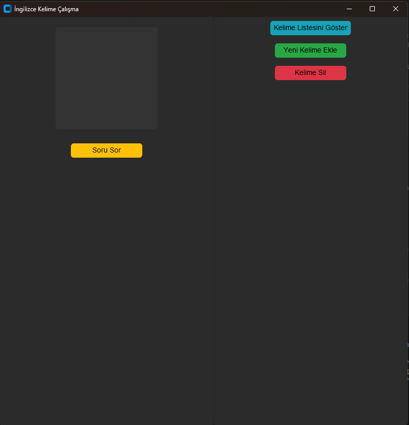
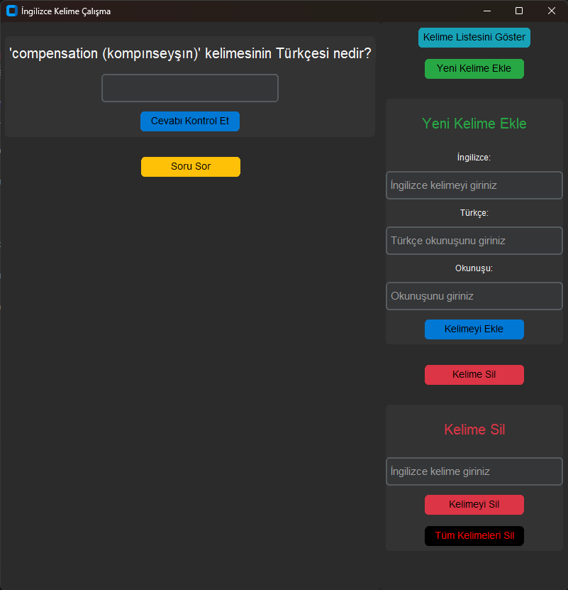
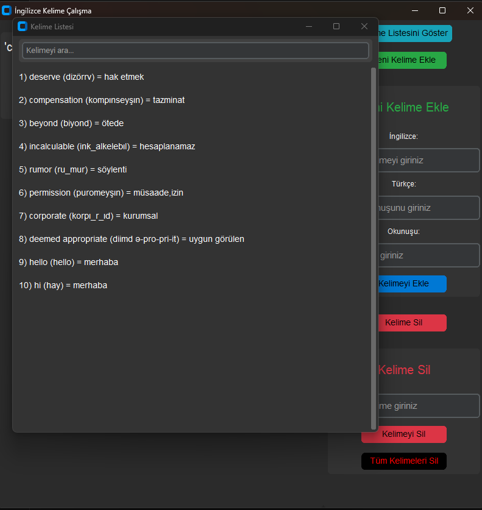

#  İngilizce Kelime Çalışma Uygulaması  

Bu program, İngilizce kelime öğrenmek isteyenler için geliştirilmiş basit bir kelime test uygulamasıdır.  

##  Özellikler  
-  Yeni kelimeler ekleyebilir ve silebilirsiniz.  
-  Rastgele sorular sorarak kendinizi test edebilirsiniz.  
-  Mevcut kelime listenizi görebilirsiniz.  
-  Arama özelliği ile eklediğiniz kelimeleri hızlıca bulabilirsiniz.  

## 📸 Ekran Görüntüsü  

### Görüntü 1


### Görüntü 2


### Görüntü 3


##  Kurulum  

**Python Gereksinimi:**  
Bu proje **Python 3.x** sürümü ile çalışmaktadır. Eğer sisteminizde Python yüklü değilse, [Python'un resmi web sitesinden](https://www.python.org/downloads/) uygun sürümü indirip yükleyin.

**Bağımlılıkları Yükleme:**  
Aşağıdaki komutu terminalde çalıştırarak gerekli kütüphaneleri yükleyebilirsiniz:  

```sh
pip install customtkinter
```

## Lisans
Bu proje [MIT Lisansı](LICENSE) ile lisanslanmıştır.
